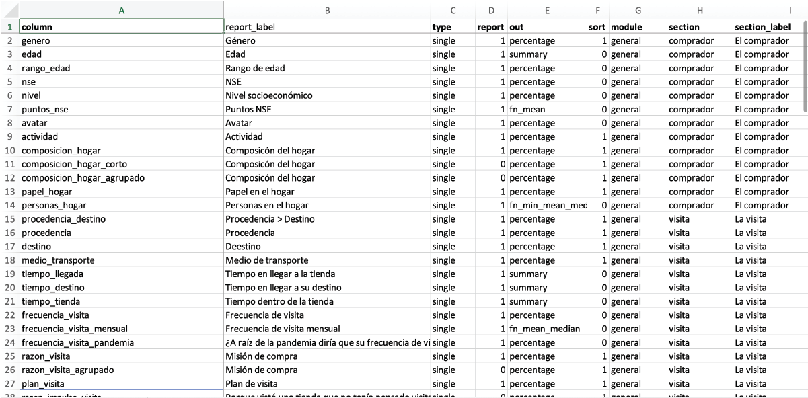
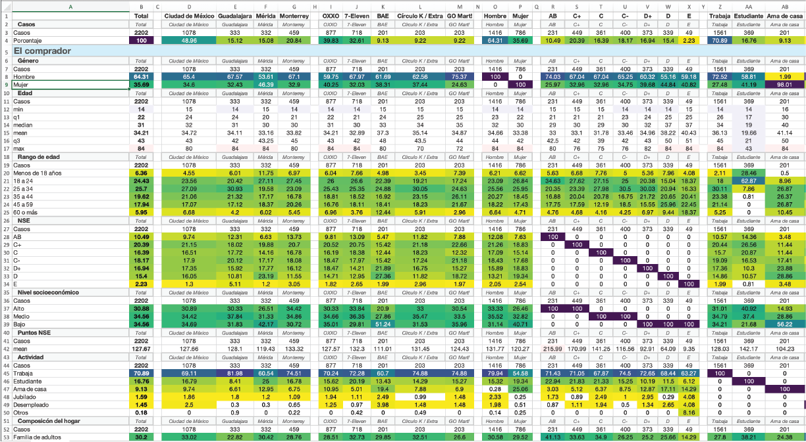
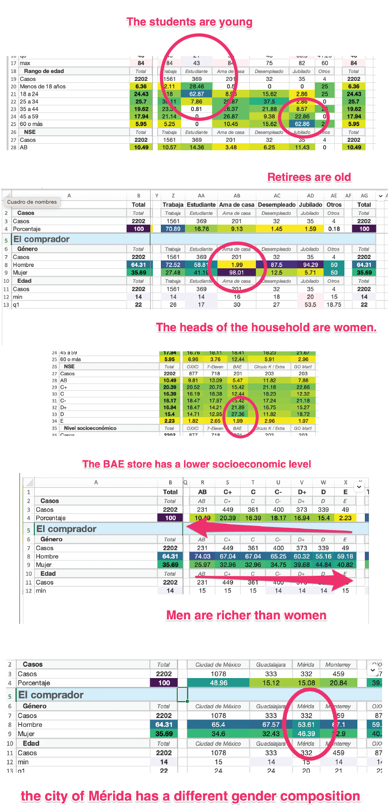

---
output:
  html_document: default
  word_document: default
---

Nueva version: feb 13, 2023

Aqui se agregan mas lineas

ddd
# DataBook for R


## Package proposal 

This package is designed to solve multiple problems that occur when working with heterogeneous teams in marketing research projects.

I have been working for years conducting "Shopper Marketing Research" in different channels and we tried different ways of dealing with data communication problems, Finally we found this new way of working that solves the problem in a good way.

## Problems to solve

-   There are several teams in Marketing Research Projects

    -   Data management team(usually Data scientist wich use R and Python)
    -   Presentation creators team
    -   Customer contact team
    -   Customer information users
    -   Other parts information users

-   The information must travel in both directions between the teams

    -   Until a "final" version of presentations are found, data must travel several times between teems
    -   This process can last for months
    -   there are many waiting time

-   The analysis of the data is not static, over time new information needs arise, so information shape is always a moving target

-   Only Data Management has knowledge of R and Python.

    -   Other teams or customers are not interested in learning a new skill and if they do, there are a constant personal rotation in corporations

-   Information sharing infrastructure

    -   If we want to share data, between teams nimbly, we need an infrastructure like a Shiny server or R Connect.

## What we need

-   A data book where most of the information crossings are already done

-   A file format that can be easily shared via email without the need for am specialized server.

This way all teams can read the information they need, without the having to learn new skills or invest in infrastructure.

## Types of data where the solution works

In social research and marketing data, there are lots of categorical variables, this solution works well in this kind of data. If we have a database with many numerical, we probably need dot plots and regressions to analyze and the data book will not be adequate.

## Solution

### Variables Metadata

We need a dataframe that describes the variables that we want to include in the report, along with additional data that will help us to make the process flexible.



### Data Groups

We need a set of columns that we will call **groups** in order to generate sections of information


```
  groups_encuestas <- c("cadena", 
                        "ciudad",
                        "genero", 
                        "nse",
                        "nivel",
                        "razon_visita_agrupado",
                        "medio_transporte",
                        "dia_semana",
                        "fin_semana",
                        "horario",
                        "procedencia_destino_top", 
                        "sport_user"
  )
```

### Generate the "book"

```
rm(list=ls())
library(tidyverse)
library(SbcRepTables)

surveys <- read_rds("./data/surveys.rds")
surveys_mtd <- read_rds("./data/surveys_mtd.rds")
column_groups <- c("ciudad", "cadena","genero", "nse", "actividad")


# Create list of data frames
data_df <-
    surveys %>%
    sbc_report_list( surveys_mtd,
                     column_groups)

# Create HTML from data
surveys_html_sheet  <-
    data_df %>%
    sbc_html_heatmap(plasmaRows = c(""),
                     groupSeparator = T
    )

# View on RStudio
surveys_html_sheet %>% sbc_viewer()

# Or copy to excel
surveys_html_sheet %>% clipr::write_clip()
 
```




You can open the "databook_sample.xlsx" file to try yourself


### Get quick insight

As you get use to look at the colors of the data, it is very easy to find insights




### Share the data

Now that you have the book in Excel, Pages, Google sheets or Open Office you can send it to other people to create documents using the data that is more important for them. A single book can contain lots of information, that user can copy easily to paste tables, create graphics or get insights in its favorite application. They do not need to know R or Python to use the information.


## What we have 

* Functions to construct the databook 'sbc_report_list' ,'sbc_html_heatmap'
* A version using parallel package for huge datasets 'sbc_report_list_v2' ,'sbc_html_heatmap_v2'
* Can process numerical and categorical data in several ways like percentage, incidence, single, multiple, custom functions
* An HTML output that can easily be Paste in excel, and keeps looking greate


## What we want

* Interact directly with excel, the test now do not scale good with lots of data
* Create a stand-alone DataBook in Angular, in order to distribute the book without the need of external software
* Comparation between data from different dates


